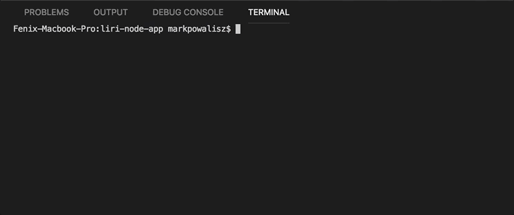

# Liri-Node-App

## Description
Liri is a smart app that takes in command line requests and initiates API calls using NPM packages. 

### Running included actions with a desired value will return a result.
* node liri.js movie-this "Movie Name" - Choose a movie
* node liri.js spotify-this-song "Song Name" - Choose a song
* node liri.js do-what-it-says - Try and find out
* node liri.js my-tweets - Triggers the Twitter Search API

## Prerequisites
* Node.js
* NPM
* A Twitter Account (For Client Key/Secret)
* A Spotify Account (For API Key)

## Technologies Used
* Node.js - https://nodejs.org/
* JavaScript - https://www.javascript.com/
* jQuery - https://jquery.com/
* NPM Packages
  * Twitter - https://www.npmjs.com/package/twitter
  * Node-Spotify-API - https://www.npmjs.com/package/node-spotify-api
  * OMDB API - http://www.omdbapi.com/
  * Request - https://www.npmjs.com/package/request
  * DotEnv - https://www.npmjs.com/search?q=dotenv

## Built With
Visual Studio Code

## Author
Mark Powalisz

